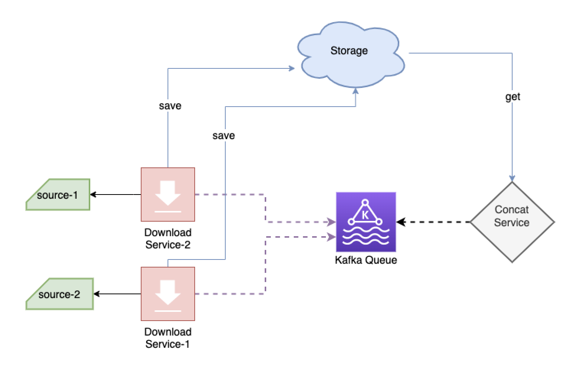

# Two Micros

System consists of two different microservices(Dowlnload[DLS] and Concat[CS] services) with the following tasks.
Multiple count of DLS downloade data from different sources and save to Storage, DLS sends messages about data details(id, path) to CS service using Kafka Queue. CS service gets data from storage and merge data according to Kafka Queue messages.

## Description
Project has two microservices:
- Download Service
    - Service has two sources. 
    - Downloading images from csv file and storing on local disk
    - Sending image local paths to kafka queue.
- Concatenate Service
    - Consuming image local paths from kafka queue.
    - Merging images.

Project has one util module
- Util
    - Common infrastructure

I tried to make project extendable and simple. As I did not have Kafka experience before, it took a while to learn it. I used util module to avoid code repeat and store common static functions and variables. In concatenate service I created DB to store concatenating images. Concatenation microservice consists of two parts. First part is consuming information from kafka queue and second concatenate ready images. Even if concatenate service crashed and restarted, there will be no data loss. Consumed information stored in DB and image_combiner part proceeding independently.
Note : I installed kafka on my local device.

## Installation

### Prerequisites:
 ***Start the kafka server***
    
    $ bin/zookeeper-server-start.sh config/zookeeper.properties
    $ bin/kafka-server-start.sh config/server.properties

 ***Create kafka topics***
 
    $ bin/kafka-topics.sh --create --zookeeper localhost:2181 --replication-factor 1 --partitions 1 --topic super_heros
    $ bin/kafka-topics.sh --create --zookeeper localhost:2181 --replication-factor 1 --partitions 1 --topic alter_egos

### Environment 
- Python 3.6

### Virtual environment
    $ cd code  # root directory
    $ virtualenv -p python3 venv
    $ source venv/bin/activate

### Dependicies
    $ python setup.py install

### Create a DB
    $ psql
    $ CREATE ROLE brighter WITH CREATEDB CREATEROLE LOGIN
    $ CREATE DATABASE budget OWNER brighter;
    
### Create tables
    $ python two_micros/concatenation_service/manage_db.py create
    

## Running downloader service
    $ python two_micros/download_service/__init__.py 

or

    $ dls

## Running concatenate service
    $ python two_micros/concatenation_service/__init__.py 

or

    $ cs

### Local data storage
-   csv files are located in root/csv folder. We can change path to remote from config.ini file.
-   images are stored in root/images folder.
